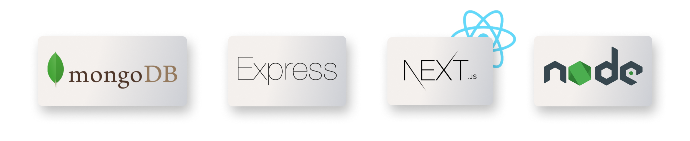

## M E N(R) N Stack CRUD

## Code Explanation
This code is a basic CRUD (Create, Read, Update, Delete) application using Node.js, Express.js, and MongoDB. The code first imports the necessary dependencies (Express and cors). Then, it initializes the Express app and sets the port to 8080.

Afterwards, it establishes a connection to a MongoDB database using the Mongoose library. It sets some options and then logs a message to the console once the connection is established.

The code then defines four endpoints:

**`POST /add-patient`**: Adds a new patient record to the database by creating a new Patient object using the data in the request body and then saving it to the database.

**`GET /get-patient`**: Retrieves all patient records from the database and returns them as a JSON response.

**`PATCH /update-patient/:id`**: Updates an existing patient record by finding it in the database using its ID and updating its fields with the data in the request body.

**`DELETE /delete-patient/:id`**: Deletes an existing patient record from the database using its ID.

For each endpoint, the code handles potential errors and returns appropriate responses with a status code, a message, and any relevant data (e.g. the updated patient record). The endpoints use the async/await syntax to work with the asynchronous nature of database operations.

### Frontend

For our frontend I'll utilize our Next.js template in the NextJS folder, you can find it [here](https://github.com/PAVincius/Estudo/tree/main/NextJS/learning-nextjs).

